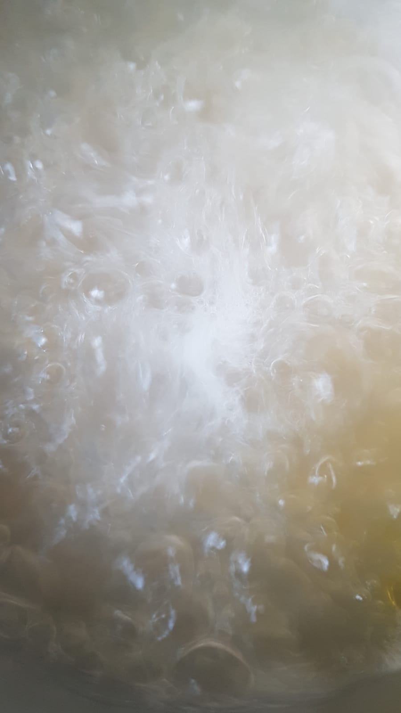
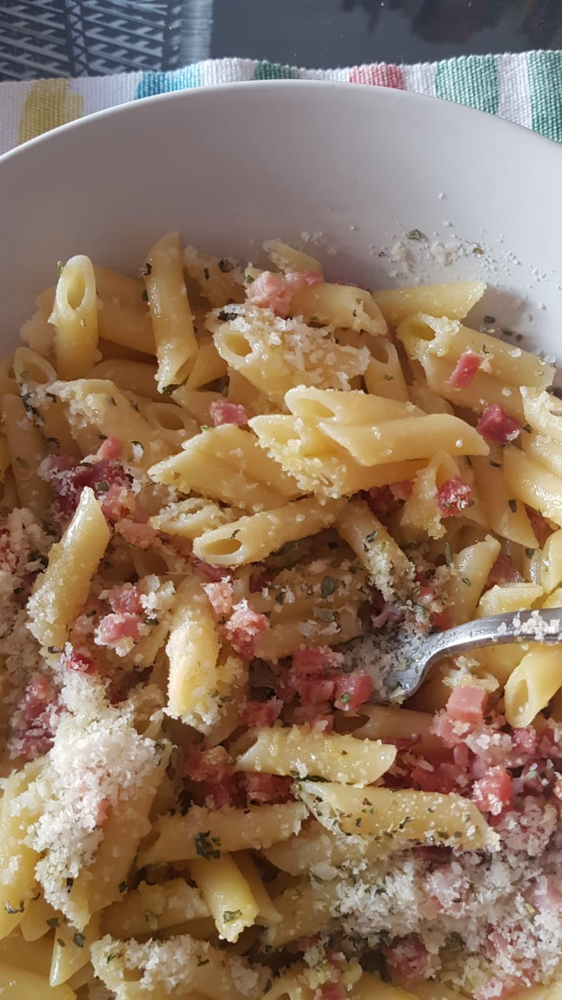

```{r, include=FALSE}
library(rmarkdown)
library(markdown)
library(extrafont)
loadfonts(device = "win")
```

Ya que este año nuestro genial seminario empieza los viernes a las 16:00, nuestra amiga y compañera Sofía ha sugerido esta sección en la que podremos dejar constancia de lo triste que puede ser la existencia para los y las doctorandas. ¿Qué se come cuando llevas toda la semana trabajando sin parar y ni sabes cuando fue la última vez que fuiste al supermercado? *Cosas precarias*. Cosas lúgubres. 

Ella misma empieza esta sección con su 'pasta con cosas' 


{width=600, height=300}

¿Se está cociendo pasta? ¿Nos encontramos ante uno de los ríos del infierno de Dante? Es difícil saberlo. 

Una vez hemos conseguido cocer la pasta. Simplemente tenemos que echarle un poco de lo que haya sobrevivido en nuestra nevera. Preferiblemente cosas saladas, pero es un mundo díficil y no juzgamos a nadie. 


{width=600, height=300}
