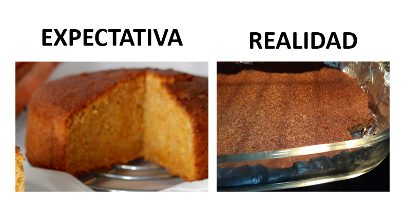

```{r, include=FALSE}
library(rmarkdown)
library(markdown)
library(extrafont)
loadfonts(device = "win")
```

Nuestra amiga Mar, gran investigadora y mejor memera, nos envía su receta y triste historia:


 ---- 

Era mi cumpleaños y quería llevar un bizcocho de zanahoria para celebrarlo en el CIMCYC con mis compañeras/os. Leí una receta de mi madre de un bizcocho buenísimo y me puse manos a la obra.

SPOILER: salió mal.

{width=600, height=300}

Nótese la ausencia de grosor.

P.D.: Aún no sé dónde estuvo el fallo.